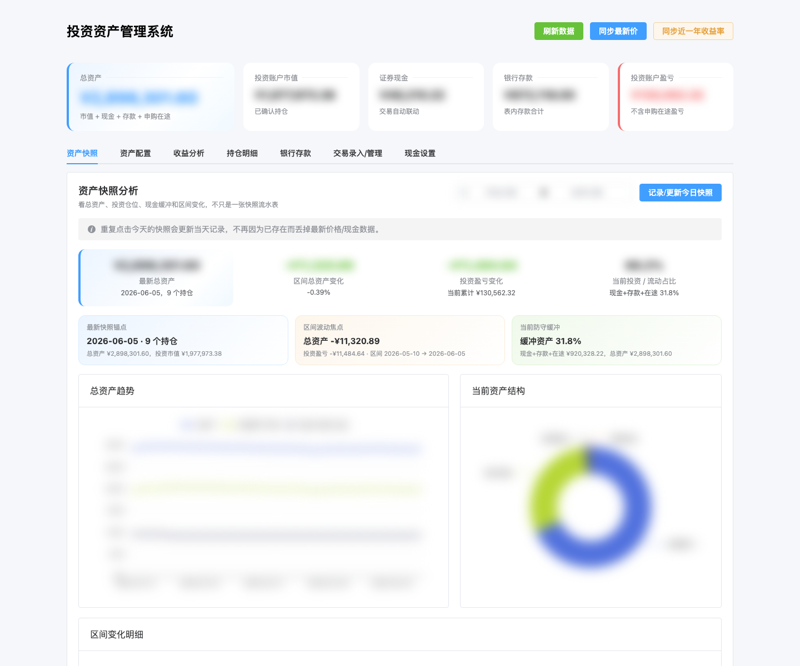
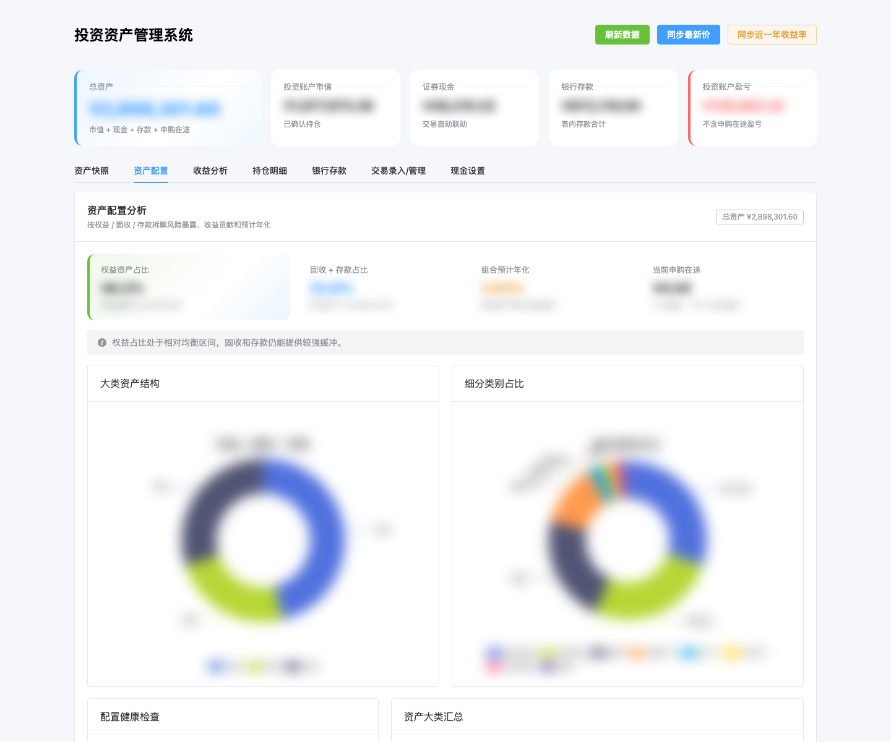
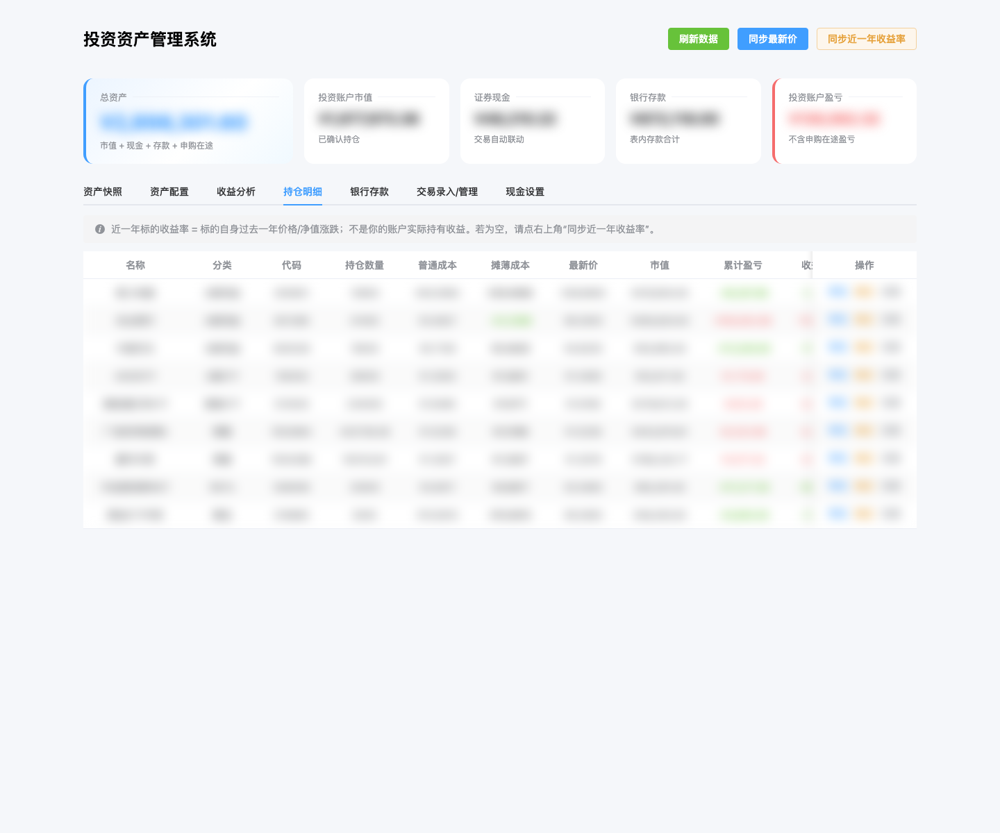
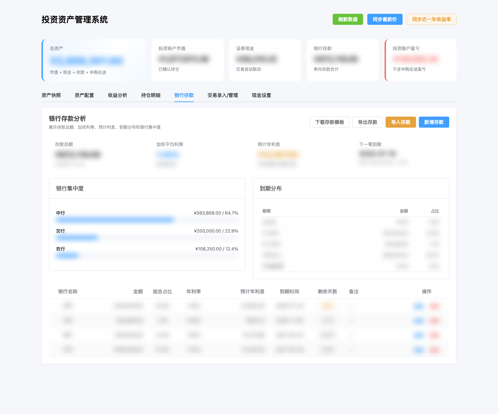
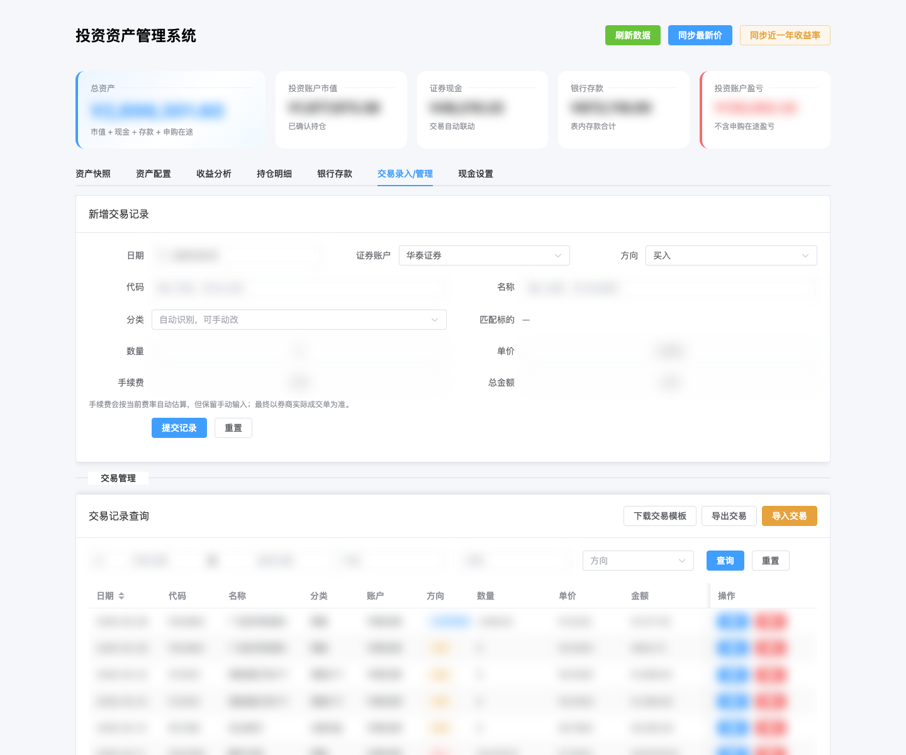
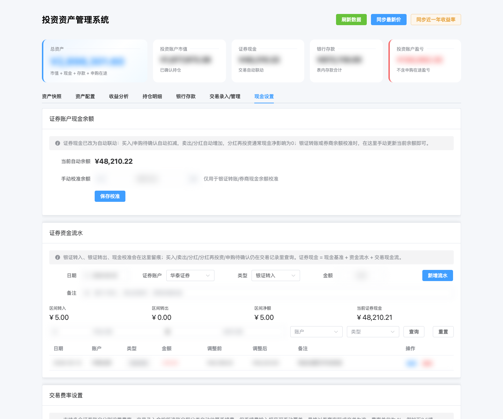
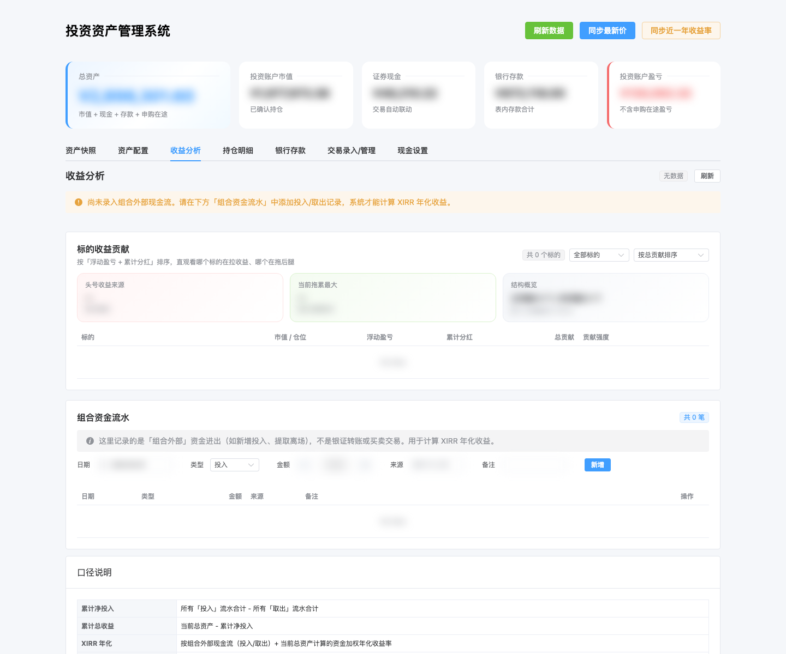

# 投资资产管理系统 / Invest Tracker

> 更新时间：2026-07-11  
> 本项目是本地运行的个人投资资产管理系统，用于记录持仓、交易、证券现金、银行存款、资产快照和组合收益表现。  
> 变更记录见 [CHANGELOG.md](CHANGELOG.md)。

---

## 1. 功能概览

当前系统覆盖：

- 持仓管理：A股权益、A股 ETF、港股 ETF、REITs、黄金、债基、其他资产；
- 交易录入/管理：买入、卖出、分红、分红再投资、申购待确认等；
- 证券现金：现金基准、资金流水、交易现金流自动联动；
- 银行存款：金额、利率、到期日、预计利息、到期分布；
- 资产快照：记录/更新每日资产状态，支持区间分析；
- 资产配置：权益/固收/存款结构、集中度、预计年化；
- 收益分析：组合表现、时间序列、当前仓贡献 + 全周期盈亏、现金流；
- 首页双口径：持仓浮盈（普通成本）与全周期盈亏（摊薄成本，接近券商累计）；
- 价格/收益同步：支持最新价格、基金净值、近一年收益率同步；
- 持仓校正：支持以券商实际持仓作为对账锚点；
- 半自动分红：扫描 A 股个股 + 场内 ETF/港股ETF/REIT 分红草稿，自动识别已有流水后确认入账；
- 多账户费率：支持按证券账户、资产类别、方向估算手续费。

技术栈：

- 后端：FastAPI + SQLite；
- 前端：Vite + Vue 3 + Element Plus + ECharts；
- 部署：Docker Compose，前端由 Nginx 托管，后端由 Uvicorn 提供 API。

---

## 2. 项目结构

```text
invest-tracker/
  backend/
    main.py                    # FastAPI 应用入口、路由挂载、lifespan 初始化
    database.py                # 数据库连接与通用设置读写
    schema.py                  # 集中式表结构初始化与版本迁移
    dashboard.py               # 总览数据计算
    holdings.py                # 持仓兼容门面
    holding_calculator.py      # 持仓计算逻辑
    price_sync.py              # 最新价格/净值同步
    return_sync.py             # 近一年收益率同步
    cash.py                    # 证券现金计算
    fee_settings.py            # 多账户费率设置
    snapshots.py               # 资产快照逻辑
    performance.py             # 组合表现分析
    market.py                  # 市场摘要 + 价格预警（只读观察）
    routers_*.py               # 按业务拆分的 API 路由
    Dockerfile
    requirements.txt

  frontend/
    index.html                 # HTML 挂载壳（#app）
│   │   App.vue                   # 主界面壳（tabs/懒加载）
│   │   components/               # Header/首页/弹窗/登录
│   │   views/                    # 各 tab SFC（懒加载，含 MarketTab）
    package.json               # Vite/npm 脚本
    Dockerfile                 # 多阶段构建：Vite build + Nginx
    nginx.conf                 # 前端静态托管与 /api 代理
    src/
      main.js                  # Vue 应用入口
      api/index.js             # API 封装
      charts/index.js          # ECharts 渲染逻辑
      utils/index.js           # 前端工具函数
      styles/styles.css        # 样式
      modules/
        transactions.js
        deposits.js
        cash.js
        snapshots.js
        performance.js
        market.js

  tests/                       # 后端回归测试
  scripts/
    check.sh                   # 项目完整检查
    backup_db.py               # 数据库备份
    restore_db.py              # 数据库恢复
    safety_snapshot.py         # 安全快照
    cron_sync_prices.sh        # VPS 定时同步最新价（可选写快照）
    verify_vps_deploy.sh       # 部署后核对清单
    legacy_update_db.py        # 旧导入脚本，默认禁用
  data/                        # 本地 SQLite 数据，未纳入 Git
  backups/                     # 数据库备份，未纳入 Git
  docker-compose.yml
  Makefile
```

---

## VPS 部署

VPS/生产部署配置在 `deploy/vps` 分支维护，详见 [`docs/deploy-vps.md`](docs/deploy-vps.md)。

## 3. 启动方式

### 推荐：Docker Compose

```bash
cd invest-tracker
docker compose up -d --build
```

访问：

- 前端：http://localhost:8080
- 后端 API：http://localhost:8000
- 健康检查：http://localhost:8000/api/health

查看状态：

```bash
docker compose ps
```

查看日志：

```bash
docker compose logs --tail=100 backend frontend
```

停止：

```bash
docker compose down
```

### Makefile 快捷命令

```bash
make up       # 构建并启动
make down     # 停止
make restart  # 重启
make logs     # 查看日志
make ps       # 查看容器状态
make test     # 运行后端测试
make check    # 运行完整检查
```

### 本地直接运行 (非 Docker)

如果你没有 Docker 环境，或者希望直接进行本地调试：

1. **后端启动**：
   ```bash
   # 创建并激活虚拟环境，安装依赖
   python3 -m venv venv
   source venv/bin/activate
   pip install -r backend/requirements.txt
   
   # 启动 API 服务
   python backend/main.py
   ```
   后端服务将运行在 `http://localhost:8000`。
   
2. **前端启动**：
   ```bash
   cd frontend
   npm install
   npm run dev
   ```
   前端服务将运行在 `http://localhost:8080`，已配置本地 API 代理自动转发至后端的 8000 端口。

---

## 4. 前端开发说明

前端已经迁移为 Vite 项目结构。

安装依赖：

```bash
cd invest-tracker/frontend
npm install
```

本地构建：

```bash
npm run build
```

开发服务器：

```bash
npm run dev
```

说明：

- 生产环境由 Dockerfile 执行 `npm run build` 生成 `dist/`，再复制到 Nginx；
- `frontend/dist/`、`frontend/node_modules/` 已在 `.gitignore` 中排除；
- 主界面模板在 `frontend/src/App.vue`（SFC）；`index.html` 仅挂载点 + 登录关键 CSS。
- 业务逻辑在 `frontend/src/main.js` + `modules/` + `composables/`；Vue 使用 **runtime-only**。
- Element Plus 通过 `unplugin-vue-components` 按需引入，不再全量 CSS。

---

## 5. 后端开发说明

后端入口是：

```text
backend/main.py
```

当前后端已经拆为多模块：

- `schema.py`：统一负责数据库表结构初始化和版本迁移；
- `database.py`：数据库连接和 settings 读写；
- `holding_calculator.py`：持仓滚动计算；
- `price_sync.py`：最新价格/基金净值同步；
- `return_sync.py`：近一年收益同步；
- `cash.py`：证券现金计算；
- `fee_settings.py`：手续费率配置；
- `routers_*.py`：按业务拆分 API。

应用启动使用 FastAPI lifespan 初始化数据库，不再使用已过时的 `@app.on_event("startup")`。

---

## 6. 交易方向说明

常用交易方向：

| 方向 | 影响持仓 | 影响证券现金 | 说明 |
|---|---:|---:|---|
| 买入 | 增加数量 | 扣减金额+手续费 | 普通买入/基金确认申购 |
| 卖出 | 减少数量 | 增加卖出金额-手续费 | 普通卖出 |
| 分红 | 不改变数量 | 增加现金 | 现金分红 |
| 分红再投资 | 增加数量 | 不改变现金 | 分红转份额，金额计入累计分红 |
| 申购待确认 / 待确认申购 | 不生成正式持仓 | 扣减现金 | 只知道申购金额，份额/净值未确认 |

分红再投资建议录入：

- 数量：新增份额；
- 单价：分红再投资确认日净值/成交净值；
- 金额：分红金额；
- 手续费：通常为 0；
- 方向：`分红再投资`。

---

## 6.1 盈亏口径（对账用）

| 口径 | 公式 | 用途 |
|---|---|---|
| 持仓浮盈 | (最新价 - 普通成本) x 数量 + 累计分红 | 看当前仓赚亏 |
| 全周期盈亏 | (最新价 - 摊薄成本) x 数量 | 接近券商「累计盈亏」 |
| 整户总账 | 总资产 - 组合外部净投入 | 收益分析页；依赖组合资金流水 |

三套数字本就不会相等。对华泰等券商累计，优先看全周期。

## 7. 数据与安全

公开仓库前建议运行隐私检查：

```bash
bash scripts/privacy_check.sh
```

检查内容包括本机路径、数据库/备份文件、`.env`、常见密钥格式和疑似个人标识。截图文件仍需人工确认是否已经打码。

重要数据文件：

```text
data/invest.db
```

注意：

- 可用环境变量 `DB_PATH`、`BACKUP_DIR`、`APP_TIMEZONE`、`CORS_ALLOW_ORIGINS`、`MAX_BACKUP_UPLOAD_BYTES` 覆盖默认配置；
- `data/`、`backups/`、数据库文件不会提交到 Git；
- 高风险修改前建议先备份数据库；
- Git 只管理代码和测试，不管理真实资产数据。

备份数据库：

```bash
python3 scripts/backup_db.py
```

恢复数据库：

```bash
python3 scripts/restore_db.py backups/你的备份文件.db
```

创建安全快照：

```bash
python3 scripts/safety_snapshot.py
```

### 访问安全控制 (密码门锁)

如果在公网服务器部署系统，强烈建议开启密码门锁功能保护资产隐私。

1. **启用验证**：
   在服务器环境配置中设置环境变量 `INVEST_TRACKER_PASSWORD`。例如：
   ```bash
   export INVEST_TRACKER_PASSWORD="你的安全访问密码"
   ```
2. **安全保护**：
   - 启用后，所有数据查询与操作 API 均会强制校验身份。
   - 首次打开网页或退出登录后，系统会默认呈现高质感模糊锁屏，提示输入系统密码。输入正确即发放一个 30 天有效的会话 Token。
   - 临时隐藏数据：主页顶部增加了 “👁️ 显示数据” 和 “🙈 隐藏数据” 按钮，可以随时一键模糊界面。
3. **未设置密码**：
   - 如果不设置 `INVEST_TRACKER_PASSWORD` 环境变量，系统则为无锁模式，默认直接公开，便于本地直接使用。

---

## 8. 检查与测试

完整检查：

```bash
cd invest-tracker
bash scripts/check.sh
```

检查内容包括：

- `/api/health` 健康检查路由；
- Vite 前端结构和构建；
- 前端 JavaScript 语法检查；
- 后端模块存在性；
- 后端可导入性；
- Docker Compose 配置；
- 后端 pytest 回归测试；
- 前后端 HTTP 可访问性。

单独运行后端测试：

```bash
docker compose exec -T backend pytest -q /app/tests
```

当前基准：

```text
31+ passed
All checks passed
```

---

## 9. 页面截图

截图统一保存在：

```text
docs/screenshots/
```

> 说明：以下截图通过 `http://localhost:8080/?tab=...&mask=1` 生成，页面已开启金额打码，便于在 README 中展示整体 UI 和功能入口。

### 9.1 资产快照

总资产趋势、资产结构、快照历史。



### 9.2 资产配置

权益/固收/存款配置、集中度和组合健康检查。



### 9.3 市场摘要

关键指数、持仓今日贡献粗估、价格阈值预警（手动检查，不改账本）。

### 9.4 持仓明细

当前持仓、市值、成本、盈亏和持仓占比。



### 9.5 银行存款

存款总览、到期分布、预计利息和存款明细。



### 9.6 交易录入/管理

交易录入、查询、编辑、删除和交易现金联动。



### 9.7 现金设置

证券现金、资金流水、现金校正和多账户费率设置。



### 9.8 收益分析

组合表现、收益时间线、贡献分析和现金流分析。



---

## 10. 常见问题

### 页面空白

优先尝试：

1. 强制刷新浏览器：`Cmd + Shift + R`；
2. 确认前端容器已重建：

```bash
docker compose up -d --build frontend
```

3. 打开浏览器 Console 查看红色错误。

本项目 Vite 迁移后，`main.js` 必须使用带模板编译器的 Vue 构建：

```js
import { createApp } from 'vue';
```

### backend unhealthy

检查 `/api/health`：

```bash
curl http://localhost:8000/api/health
```

Docker Compose 的 backend healthcheck 依赖该路径，不能删除。

### npm build 有 warning

当前 Vite 构建可能出现依赖注释或 chunk 大小 warning，但不影响构建通过。后续如果需要，可继续做代码分包和依赖优化。
